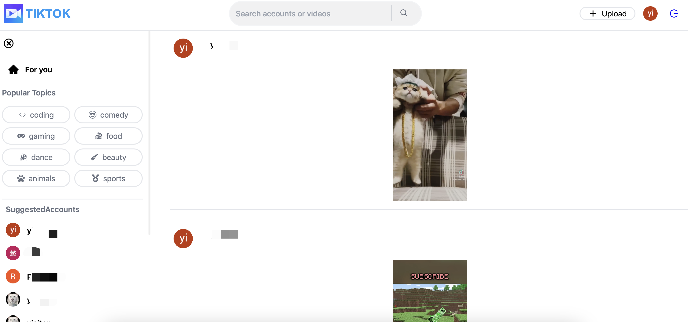

## Introduction

TikTok Clone is a mobile app that allows users to browse and watch short-form videos, just like TikTok.

## Screenshot



## Try it online

```
https://tik-tok-clone-ethen.vercel.app/
```

## Download and Installation

To install TikTok Clone, follow these steps:

1. Clone this repository
2. Install dependencies using `npm install`
3. Configure Firebase by following the instructions in the Firebase documentation
4. Start the app using `npm start`

## Functions
* Search for videos and other users by name
* Find videos by popular topics
* Post comments and like videos
* See other users' videos and the videos they like
* Upload your own videos

## Contributions
We welcome contributions from the community.